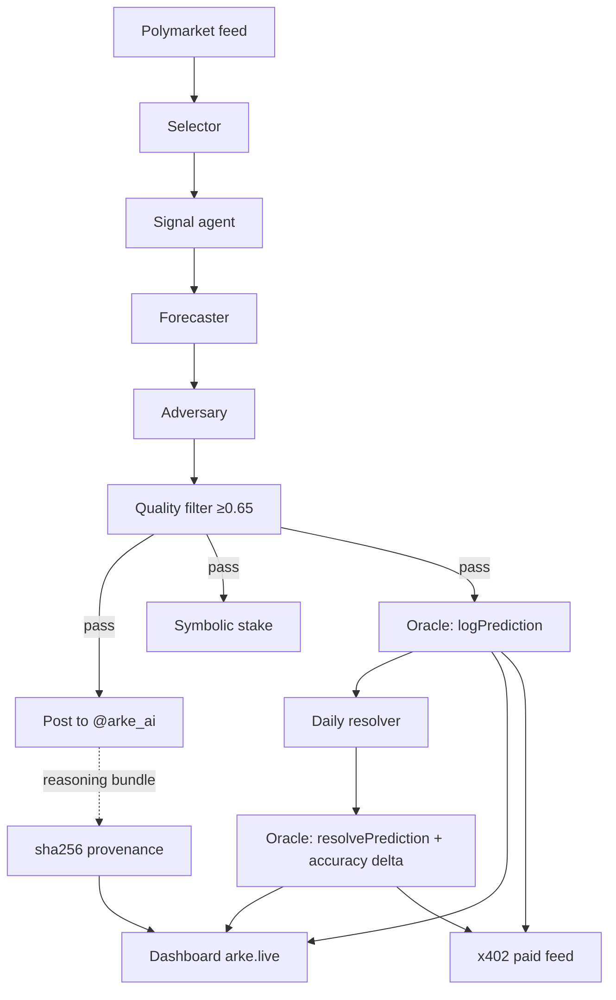

# Arke

Arke is an autonomous prediction-market intelligence agent. It selects a live
Polymarket question, produces a calibrated probability estimate through a
multi-agent council, posts the estimate publicly as [@arke_ai](https://x.com/arke_ai),
records the estimate on-chain the moment it is made, and — once the market
resolves — writes the outcome and a scored accuracy delta back to the same
on-chain ledger. Every claim it makes is timestamped before the fact and
verifiable from chain state alone.

---

## How it works — the loop

Arke runs the same loop every 6 hours, with a resolver pass once a day:

1. **Select** — pull actionable Polymarket markets and pick one by liquidity,
   urgency, and freshness (with a cooldown so it doesn't repeat itself).
2. **Forecast** — a council of models turns market data + fresh headlines into a
   single calibrated probability:
   - **Signal** (`llama-3.3-70b-versatile`) aggregates headlines into a cited report.
   - **Forecaster** (`openai/gpt-oss-120b`) emits *Arke estimates X%* with a
     directional, cited reason and the edge versus market consensus.
   - **Adversary** (`qwen/qwen3-32b`) fact-checks and rewrites once.
   - **Filter** (`openai/gpt-oss-120b`) scores the tweet on
     factual / specific / directional / credible and gates at 0.65.
3. **Stake** — a small real Polymarket position is placed behind the call as a
   commitment (hard-capped; off by default).
4. **Post** — the estimate goes out on [@arke_ai](https://x.com/arke_ai) with a
   builder-code market link.
5. **Log on-chain** — the prediction (market %, Arke %, edge, timestamp) is
   written to the oracle contract on Arc testnet.
6. **Resolve & score** — the daily resolver detects settled markets, scores
   `was_correct` against Arke's own probability, and writes the resolution +
   accuracy delta back on-chain.

A sha256-pinned reasoning bundle (the inputs, citations, and council output) is
generated for each call so the basis of every estimate is reconstructible.

---

## Product — dashboard, scoring, coverage, trade widget

The public surface is a Next.js dashboard ([arke.live](https://arke.live)) plus a
small x402 feed. The oracle contract is **unchanged** — everything below is
additive, and every new path **fails open**.

- **Tabbed dashboard.** The home page splits markets into
  `COVERED · MONITORING · RESOLVED` tabs (deep-linkable via `?tab=`). COVERED
  cards lead with big MARKET / ARKE / EDGE numbers and tuck the council reasoning
  behind a disclosure; MONITORING and RESOLVED are dense tables. Numbers render in
  a monospace *data* font, prose in a sans *prose* font. A contrarian Arke stance
  (BEAR / DISAGREE) is blue — red is reserved for resolution losses only.
  `/track-record` and `/calibration` are their own routes; marketing copy lives
  on `/about`.

- **Dual scoring (off-chain, Murphy 1973).** `db.get_dual_scores()` computes two
  numbers from resolved calls already in the DB:
  - **directional %** — was the binary call right (was Arke on the correct side)?
  - **skill (bps)** — the Murphy (1973) skill score, `(1 − Brier / Brier_ref) ×
    10000`, where `Brier_ref` is a flat-50% forecast. Positive means Arke beat a
    coin flip.

  These answer a *different question* than the contract's `getAccuracy()`. A
  Bitcoin call at 85% that resolves YES scores ~**+5100 bps skill** (it was a
  confident, correct probability) even though its **edge vs the market is ~0**
  (the crowd agreed). Both are valid: the contract measures *edge vs consensus*;
  the skill score measures *forecast quality vs random*. The skill score is
  computed **entirely off-chain** from existing data — the oracle is not touched.
  A free, never-gated `GET /v1/arke/calibration` endpoint serves the dual scores
  plus a 10-bin reliability diagram, rendered at `/calibration`.

- **Wider coverage, per-category cooldowns.** The feed now pulls 500 markets
  (was 100) across a 5–95% band (was 15–85%) to surface tail markets where Arke's
  edge is largest, with tighter quality gates to compensate (real liquidity
  > $25k, spread < 5c; the volume bar drops to $10k because Polymarket's reported
  24h volume roughly double-counts maker+taker legs). Re-post cooldowns are
  per-category: crypto resurfaces after 24h, geopolitics is held 96h.

- **MARKET WATCH + resolution posts.** When every market is within its cooldown,
  Arke posts a short *MARKET WATCH* summary instead of re-running the council on a
  stale market. When a market resolves, the resolver posts a *RESOLUTION* tweet
  (quote-tweeting the original call) with Arke %, market %, outcome, directional
  hit/miss, and per-call skill bps. Both are gated on the live `post=True` flag —
  dry runs never tweet.

- **Builder attribution + trade widget.** Tweets already carry a `?ref=` builder
  link. The dashboard's `TradeWidget` lets a visitor sign their **own** Polymarket
  order in their wallet (`window.ethereum`, EIP-712 — the exact same order struct
  and domain as `polymarket_stake.py`) and submits it via `/api/trade`, which
  injects Arke's `builderCode` bytes32 **server-side** (never exposed to the
  browser). Polymarket then attributes the 0.5% builder fee to Arke on that fill.
  **No funds are at risk on Arke's side** and there is no server custody — the
  user signs their own order. Fees only accrue when other users *voluntarily*
  trade through the widget. The plain "Trade on Polymarket ▸" link is the
  no-wallet fallback and earns nothing (Polymarket's own frontend uses its own
  builder code), so the widget is the revenue path and the link is fallback UX.

- **ERC-8004 Reputation Registry.** Arke is ERC-8004 agent **#20360** (Identity
  Registry `0x8004A8…`). The Reputation Registry (`0x8004B6…`) was verified
  **deployed on Arc testnet** (an EIP-1967 proxy) before wiring, so after each
  resolver run Arke writes its current skill score to it via
  `giveFeedback(agentId, skill_bps, 0, keccak("brier_skill"), keccak("directional"))`
  as a clearly-labelled self-attestation. Both registries are linked from the
  dashboard header, the oracle page, and the track record. (If the registry had
  not been deployed, this step would no-op and the writer would simply log and
  skip — it fails open like everything else.)

---

## Intelligence — grounding, ensemble, calibration

The forecast step is grounded in live, market-specific evidence before any model
writes a probability. Every input below **fails open**: a missing key, a network
error, or a bad response yields no block and never blocks a post or crashes the
6h loop.

**Grounded inputs** (assembled in the `[2.6]` stage and fed to the forecaster):

- **CLOB microstructure** (`agent/integrations/clob.py`, no key) — the
  Polymarket order-book midpoint and spread. The midpoint is a cleaner
  probability anchor than the last trade; the book hash is recorded as a
  citation.
- **Per-market web search** (`agent/integrations/research.py`) — a targeted
  query built from the question and resolution date, tried against **Brave**
  first then **Tavily**. Each result's *full snippet* is sha256-hashed into the
  citation (not just the title), so the evidence is tamper-evident.
- **Principled reference-class lookup** (`agent/baserates.py`) — instead of a
  brittle keyword→number table, a cheap LLM call classifies the question into a
  reference class by *semantics* (keyword matching is the fail-open fallback).
  Each class is tagged by confidence and the forecaster is told how far to trust
  it:
  - `measured` — a real counted historical frequency with a citable dataset
    (e.g. US incumbent-president re-election ≈74%). Used as a reliable anchor.
  - `prior` — a rough directional anchor where no clean dataset exists (e.g.
    near-term conflict escalation). Labelled as such; the forecaster weights it
    lightly and prefers the live domain signal.
  - `redirect` — no base rate applies; the forecaster is routed to a live signal
    (e.g. crypto price thresholds → Deribit) and asserts no base-rate number.
- **FRED macro grounding** (`agent/integrations/fred.py`, live with
  `FRED_API_KEY`) — latest values for the relevant series (unemployment, CPI,
  Fed funds, 10-year, GDP) on macro/rate markets; guards FRED's `.` missing-value
  sentinel.
- **Deribit option-implied probability** (`agent/integrations/deribit.py`, no
  key) — for "BTC/ETH above $X by date" markets, approximates the risk-neutral
  `Pr(ITM) ≈ |call delta|` from the nearest-strike option.
- **ACLED conflict grounding** (`agent/integrations/acled.py`, live with
  `ACLED_EMAIL` + `ACLED_PASSWORD`) — 30-day event and fatality counts for the
  country in the question, as a base-rate anchor for escalation/ceasefire
  markets. Uses a **durable token-refresh** design: the access token is cached on
  disk (`.acled_token.json`, gitignored), refreshed via the 14-day refresh token
  without re-sending the password, and the cache self-heals on a 401.

**Optional median-of-3 ensemble** (`ENABLE_ENSEMBLE=1`, default off) — runs three
forecasters with different model + framing combos (gpt-oss-120b superforecaster,
llama-3.3-70b base-rate-first, qwen3-32b devil's-advocate) and aggregates by the
**median** of their probabilities (Schoenegger 2024). Falls back to the single
forecaster if fewer than two succeed.

**Optional calibration hook** (`ENABLE_CALIBRATION=1`, default off,
`agent/calibration.py`) — fixed log-odds **extremization** (Baron et al. 2014)
while the resolved sample is small, switching to **Platt scaling** (pure-Python
logistic regression) once ≥50 calls have resolved. The raw and calibrated
probabilities are both retained in the reasoning bundle; the calibrated value is
what gets logged on-chain.

**Per-category Brier tracking** — each call is tagged `crypto` / `macro` /
`politics` / `geopolitics` / `other`, and the feed's `/v1/arke/track-record`
summary exposes a `brier_by_category` breakdown alongside the headline Brier.

Both toggles default **off**, so the live loop's behaviour is unchanged until the
operator flips them.

---

## On-chain artifacts

| Artifact | Value |
|---|---|
| Oracle contract | `0x767D0eD2850D57C4EF969976088Be44A5Adcfa07` |
| Chain | Arc testnet (chainId `5042002`) |
| Explorer | https://testnet.arcscan.app/address/0x767D0eD2850D57C4EF969976088Be44A5Adcfa07 |
| Predictions logged | 13 (and counting) · resolved: 0 |
| Sample log tx | `0x2de742ccc262b1018ceb57e5be71f40d521a6b477a3f3dafc5631243118a7826` |
| Sample published call | https://x.com/arke_ai/status/2058403858062151843 |
| Paid feed | `http://feed.arke.live:8402` — x402: `$0.001`/call, `$0.01`/track-record |
| x402 payment recipient | `0x35a894fd32f05F5B7f00D8940718f7aDb4D2D8fE` |
| Builder address | `0x310072d29a53aa0650e09628005a4704e9c4b0d0` |
| ERC-8004 agent identity | Agent ID `20360` · registry `0x8004A818BFB912233c491871b3d84c89A494BD9e` · mint tx `0xef3c487260357830d1f0f12e96786443337b7f7d52e5f86d02ba248ed0a38531` |
| Sample stake tx | _pending_ |
| Sample x402 receipt | _pending_ |

Operating since 2026-05-18.

---

## Agent-callable (MCP)

Arke is an MCP server, so other agents — Claude Desktop, Cursor, Cline,
Continue, or any MCP client — can call its prediction intelligence directly.
The server (`agent/mcp_server.py`) is a thin transport wrapper over the same DB
queries, feed helpers, and oracle reads the feed uses; it speaks stdio and logs
to stderr only. Every tool fails open — an underlying error returns a structured
error dict, never a crash.

**Eight tools — five free, three paid:**

| Tool | Tier | Returns |
|---|---|---|
| `get_latest_call` | free | Most recent calibrated call + onchain tx + reasoning hash |
| `get_track_record` | free | Count, directional accuracy, Brier skill score, by-category |
| `get_calibration` | free | 10-bin reliability diagram + dual scores |
| `verify_onchain` | free | Confirm a `condition_id` was logged onchain before resolution |
| `list_covered_markets` | free | Markets Arke is covering (calls not yet resolved) |
| `get_market_intelligence` | **paid ~$0.01** | Full council output + provenance bundle for a market |
| `get_prediction_bundle` | **paid ~$0.005** | Full provenance bundle by `reasoning_cid` |
| `request_forecast` | **paid ~$0.05** | Enqueue an on-demand council run; returns a job id |

**Run it:** `pip install -e .` then `arke-mcp` (or `python -m agent.mcp_server`).

**Claude Desktop:** drop `claude_desktop_config.example.json` into your Claude
Desktop config (renaming to `claude_desktop_config.json`), restart, then ask
*"What was Arke's latest forecast?"* (free) and *"Get me Arke's full intelligence
on market X"* (paid). The snippet:

```json
{
  "mcpServers": {
    "arke": {
      "command": "uvx",
      "args": ["--from", "git+https://github.com/patrickbdevaney/arke", "arke-mcp"],
      "env": {
        "ARKE_FEED_BASE": "https://feed.arke.live:8402",
        "ARC_RPC_PRIMARY": "https://rpc.testnet.arc.network",
        "ORACLE_CONTRACT_ADDRESS": "0x767D0eD2850D57C4EF969976088Be44A5Adcfa07"
      }
    }
  }
}
```

### Payments — sub-cent USDC, x402-compatible (Circle Nanopayments)

The paid tools and the paid feed endpoints settle in **sub-cent USDC**. The
gating is the standard x402 402-handshake, with two interchangeable backends
behind one unified verifier (`agent/payments.py`):

- **Circle Nanopayments via Circle Gateway** (Arc testnet) — x402-compatible:
  the buyer signs an EIP-3009 authorization, the hosted Gateway facilitator
  verifies it (canonical x402 v2 `POST /verify` → `isValid`), and batched
  settlement accrues seller revenue in a Gateway Balance withdrawable to
  `ARKE_PAYOUT_WALLET`. **Live when `CIRCLE_GATEWAY_FACILITATOR_URL` is set.**
- **Plain x402** — the existing path. **Used whenever Gateway is unset**, and as
  an automatic fallback if Gateway verification errors. Nothing hard-breaks.

Honest status: Nanopayments is **dormant until the Gateway env is configured**;
until then the feed serves the existing x402 path unchanged. There is no new
contract — Circle's facilitator + Gateway handle settlement and the oracle is
untouched. Withdrawing the Gateway Balance to the payout wallet is a manual
operator action (Circle console / script), not automated here.

### A2A demo (record the loop end-to-end)

`demo/a2a_buyer.py` is a standalone buyer agent that spawns the Arke MCP server,
calls a free tool, then calls a paid tool, signs an EIP-3009 authorization, and
retries with payment — printing a clean transcript at each step:

```bash
# From the repo root. The script spawns the MCP server itself.
python demo/a2a_buyer.py
```

If `CIRCLE_GATEWAY_FACILITATOR_URL` or `TEST_BUYER_PRIVATE_KEY` is unset, the
demo runs the free tool, shows the 402 challenge, and prints
*"paid path skipped — set Gateway env to demo payment"* — it never hard-fails.
`TEST_BUYER_PRIVATE_KEY` is **local only** (a Gateway-funded test wallet); never
put it on the VPS and never commit it.

---

## Verify it yourself

The track record does not depend on trusting Arke's dashboard. The oracle
contract is the source of truth — reconstruct it directly from Arc testnet:

```python
import json
from web3 import Web3

w3 = Web3(Web3.HTTPProvider("https://rpc.testnet.arc.network"))  # chainId 5042002
oracle = "0x767D0eD2850D57C4EF969976088Be44A5Adcfa07"
abi = json.load(open("deploy/oracle_abi.json"))
c = w3.eth.contract(address=Web3.to_checksum_address(oracle), abi=abi)

print("predictions:", c.functions.getPredictionCount().call())
print("resolved:   ", c.functions.totalResolved().call())
print("accuracy %: ", c.functions.getAccuracy().call())
```

Every prediction emits a `PredictionLogged(conditionId, question, marketPct,
arkePct, edge, timestamp)` event when made and a `PredictionResolved(conditionId,
outcome, correct, arkePct)` event when settled. Replay those events and you can
rebuild Arke's accuracy and Brier score independently — the `conditionId` ties
each on-chain record to its Polymarket market and to the published tweet.

**Two accuracy lenses (they differ by design).** The dashboard headline reports
*directional* accuracy — did Arke's call (estimate above or below 50%) match the
outcome. The on-chain `getAccuracy()` is stricter: it scores *edge versus the
market* — Arke earns credit only when its estimate diverged from the market
consensus in the direction that resolved, and simply matching the market earns
nothing. So `getAccuracy()` reads at or below the dashboard's directional figure;
both are early-sample numbers that converge as more markets settle.

For an individual call, the paid feed returns the full record (`was_correct`,
`oracle_resolve_tx`, reasoning hash); the free `/v1/arke/preview/{conditionId}`
endpoint confirms a call exists without revealing the estimate.

---

## Architecture



- **Scheduler** runs the loop on startup and every 6h; the resolver every 24h.
- **Dashboard** (`arke.live`, Next.js on Vercel) renders the track record,
  accuracy/Brier chart, and a per-call verify panel sourced from the feed.
- **Paid feed** (FastAPI, x402-gated) exposes per-call records and the
  track record as paid endpoints.

---

## Honest tradeoffs

- **The accuracy ledger lives on Arc testnet.** The Brier/accuracy record is what
  matters for credibility, and it is fully on-chain — but on a testnet, so the
  gas is free and the ledger is a demonstration rather than a mainnet commitment.
- **Symbolic stakes are on Polygon mainnet.** When enabled, the bond behind each
  call uses real USDC on Polymarket, hard-capped per-position and per-lifetime.
  The two chains serve different purposes: testnet for the immutable score,
  mainnet for the real (small) skin in the game.
- **Provenance is pinned to the site with a sha256 hash.** The reasoning bundle
  is hashed and the hash is stored with the prediction; the bundle itself is
  served alongside the dashboard rather than pinned to permanent storage.
- **Contract roadmap.** A v2 oracle will store the reasoning CID in the
  prediction struct directly, so the provenance hash is on-chain rather than
  referenced off-chain.

---

## Running it

- Dry run (safe, never posts): `python prove_the_loop.py`
- The agent runs as a systemd service that posts live on the 6h cadence.
- Configuration is via environment variables documented in `.env.example`
  (all secrets stay in a local, untracked `.env`).
