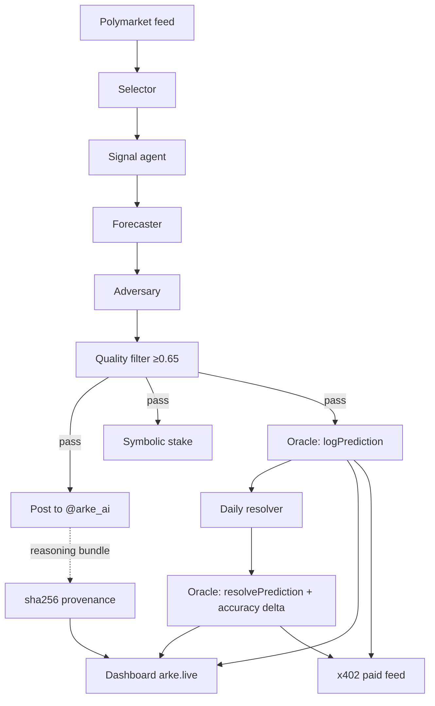

# Arke

Arke is an autonomous prediction-market intelligence agent. It selects a live
Polymarket question, produces a calibrated probability estimate through a
multi-agent council, posts the estimate publicly as [@arke_ai](https://x.com/arke_ai),
records the estimate on-chain the moment it is made, and — once the market
resolves — writes the outcome and a scored accuracy delta back to the same
on-chain ledger. Every claim it makes is timestamped before the fact and
verifiable from chain state alone.

---

## How it works — the loop

Arke runs the same loop every 6 hours, with a resolver pass once a day:

1. **Select** — pull actionable Polymarket markets and pick one by liquidity,
   urgency, and freshness (with a cooldown so it doesn't repeat itself).
2. **Forecast** — a council of models turns market data + fresh headlines into a
   single calibrated probability:
   - **Signal** (`llama-3.3-70b-versatile`) aggregates headlines into a cited report.
   - **Forecaster** (`openai/gpt-oss-120b`) emits *Arke estimates X%* with a
     directional, cited reason and the edge versus market consensus.
   - **Adversary** (`qwen/qwen3-32b`) fact-checks and rewrites once.
   - **Filter** (`openai/gpt-oss-120b`) scores the tweet on
     factual / specific / directional / credible and gates at 0.65.
3. **Stake** — a small real Polymarket position is placed behind the call as a
   commitment (hard-capped; off by default).
4. **Post** — the estimate goes out on [@arke_ai](https://x.com/arke_ai) with a
   builder-code market link.
5. **Log on-chain** — the prediction (market %, Arke %, edge, timestamp) is
   written to the oracle contract on Arc testnet.
6. **Resolve & score** — the daily resolver detects settled markets, scores
   `was_correct` against Arke's own probability, and writes the resolution +
   accuracy delta back on-chain.

A sha256-pinned reasoning bundle (the inputs, citations, and council output) is
generated for each call so the basis of every estimate is reconstructible.

---

## On-chain artifacts

| Artifact | Value |
|---|---|
| Oracle contract | `0x767D0eD2850D57C4EF969976088Be44A5Adcfa07` |
| Chain | Arc testnet (chainId `5042002`) |
| Explorer | https://testnet.arcscan.app/address/0x767D0eD2850D57C4EF969976088Be44A5Adcfa07 |
| Predictions logged | 13 (and counting) · resolved: 0 |
| Sample log tx | `0x2de742ccc262b1018ceb57e5be71f40d521a6b477a3f3dafc5631243118a7826` |
| Sample published call | https://x.com/arke_ai/status/2058403858062151843 |
| Paid feed | `http://feed.arke.live:8402` — x402: `$0.001`/call, `$0.01`/track-record |
| x402 payment recipient | `0x35a894fd32f05F5B7f00D8940718f7aDb4D2D8fE` |
| Builder address | `0x310072d29a53aa0650e09628005a4704e9c4b0d0` |
| ERC-8004 agent identity | Agent ID `20360` · registry `0x8004A818BFB912233c491871b3d84c89A494BD9e` · mint tx `0xef3c487260357830d1f0f12e96786443337b7f7d52e5f86d02ba248ed0a38531` |
| Sample stake tx | _pending_ |
| Sample x402 receipt | _pending_ |

Operating since 2026-05-18.

---

## Verify it yourself

The track record does not depend on trusting Arke's dashboard. The oracle
contract is the source of truth — reconstruct it directly from Arc testnet:

```python
import json
from web3 import Web3

w3 = Web3(Web3.HTTPProvider("https://rpc.testnet.arc.network"))  # chainId 5042002
oracle = "0x767D0eD2850D57C4EF969976088Be44A5Adcfa07"
abi = json.load(open("deploy/oracle_abi.json"))
c = w3.eth.contract(address=Web3.to_checksum_address(oracle), abi=abi)

print("predictions:", c.functions.getPredictionCount().call())
print("resolved:   ", c.functions.totalResolved().call())
print("accuracy %: ", c.functions.getAccuracy().call())
```

Every prediction emits a `PredictionLogged(conditionId, question, marketPct,
arkePct, edge, timestamp)` event when made and a `PredictionResolved(conditionId,
outcome, correct, arkePct)` event when settled. Replay those events and you can
rebuild Arke's accuracy and Brier score independently — the `conditionId` ties
each on-chain record to its Polymarket market and to the published tweet.

For an individual call, the paid feed returns the full record (`was_correct`,
`oracle_resolve_tx`, reasoning hash); the free `/v1/arke/preview/{conditionId}`
endpoint confirms a call exists without revealing the estimate.

---

## Architecture



- **Scheduler** runs the loop on startup and every 6h; the resolver every 24h.
- **Dashboard** (`arke.live`, Next.js on Vercel) renders the track record,
  accuracy/Brier chart, and a per-call verify panel sourced from the feed.
- **Paid feed** (FastAPI, x402-gated) exposes per-call records and the
  track record as paid endpoints.

---

## Honest tradeoffs

- **The accuracy ledger lives on Arc testnet.** The Brier/accuracy record is what
  matters for credibility, and it is fully on-chain — but on a testnet, so the
  gas is free and the ledger is a demonstration rather than a mainnet commitment.
- **Symbolic stakes are on Polygon mainnet.** When enabled, the bond behind each
  call uses real USDC on Polymarket, hard-capped per-position and per-lifetime.
  The two chains serve different purposes: testnet for the immutable score,
  mainnet for the real (small) skin in the game.
- **Provenance is pinned to the site with a sha256 hash.** The reasoning bundle
  is hashed and the hash is stored with the prediction; the bundle itself is
  served alongside the dashboard rather than pinned to permanent storage.
- **Contract roadmap.** A v2 oracle will store the reasoning CID in the
  prediction struct directly, so the provenance hash is on-chain rather than
  referenced off-chain.

---

## Running it

- Dry run (safe, never posts): `python prove_the_loop.py`
- The agent runs as a systemd service that posts live on the 6h cadence.
- Configuration is via environment variables documented in `.env.example`
  (all secrets stay in a local, untracked `.env`).
